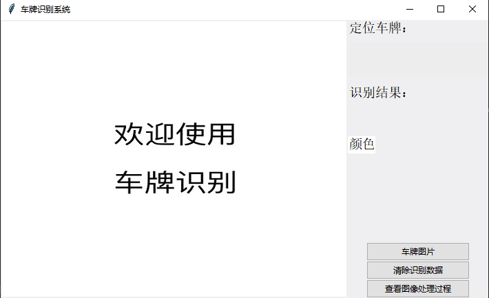
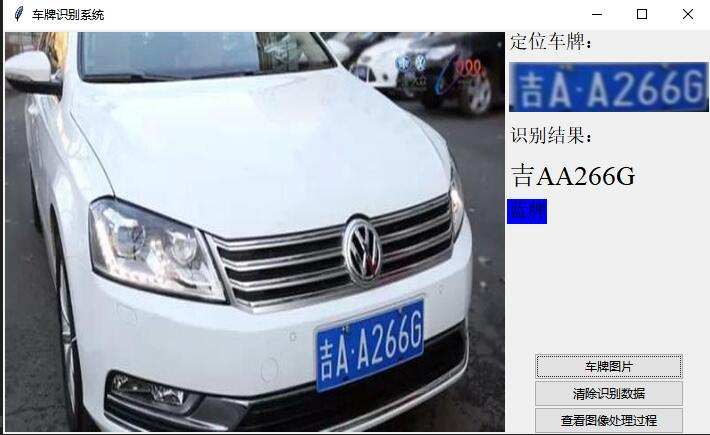
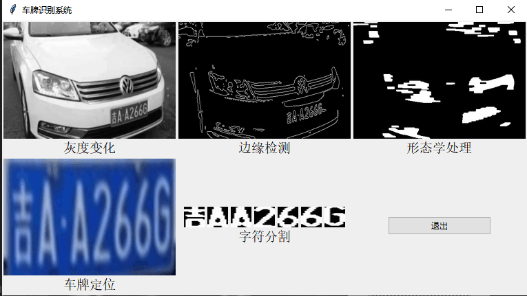

# Python opencv 车牌识别

+ 数字图像处理课程设计作业
+ Python3+OpenCV
+ 使用tkinter搭建界面
+ `tmp/`文件夹是数字图像处理过程
+ `chepai/`文件夹是车牌图片
+ `pic/`文件夹是程序界面图
+ PPT文件是验收时要讲的
+ 程序是从网上学习的并自己弄的，不完善，识别率不高

## 开发环境配置
> `pip install numpy`

> `pip install pillow`

> `pip install opencv-python`

## 图片展示

